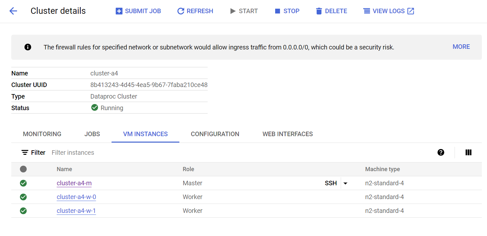
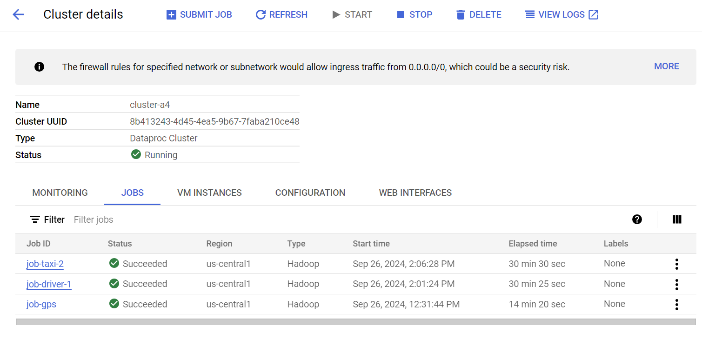
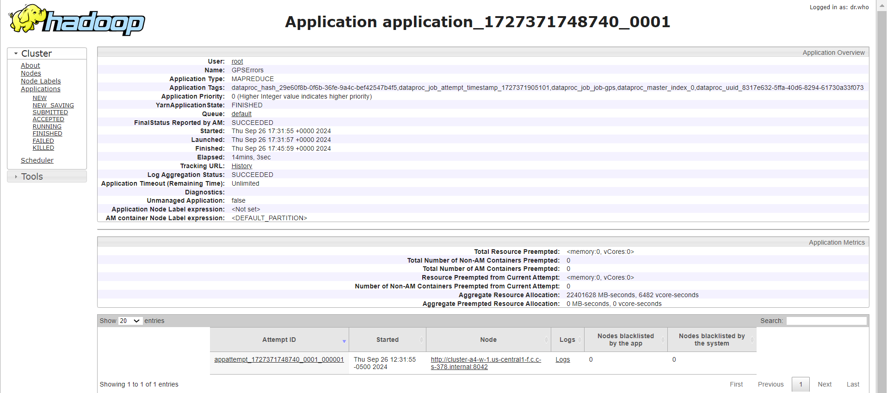
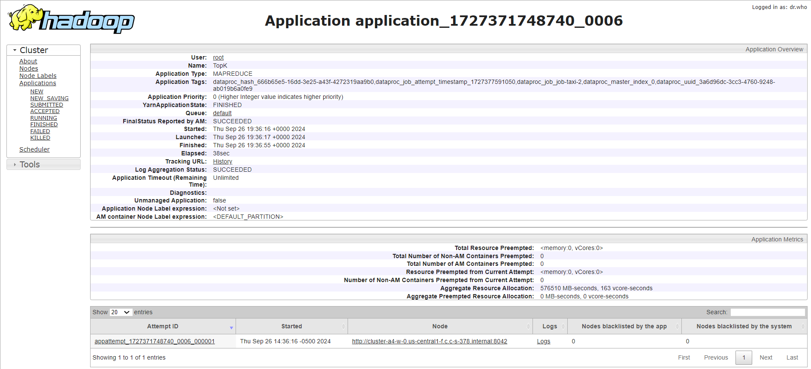

# Please add your team members' names here. 

## Team members' names 

1. Student Name: Alex Morales

   Student UT EID: am95779

2. Student Name: Jerry Ming

   Student UT EID: jm98623

3. Student Name: Arul Yamdagni

   Student UT EID: ay7494

 

##  Course Name: CS378 - Cloud Computing 

##  Unique Number: 51515
    


# Project Report
## Task 1 (Errors in GPS):
### Small Dataset
```
1	1763
2	1382
3	1097
4	886
5	830
6	693
7	1613
8	2754
9	2993
10	2887
11	2850
12	3114
13	3041
14	2900
15	2960
16	2940
17	3152
18	3502
19	4039
20	3936
21	3369
22	3075
23	2932
24	2194
```
### Large Dataset
```
1	198453
2	149629
3	113354
4	85924
5	63662
6	50864
7	104927
8	180293
9	219755
10	230093
11	223244
12	228677
13	242793
14	241225
15	251143
16	247963
17	215000
18	244767
19	304665
20	317971
21	296600
22	291543
23	279601
24	247429
```

## Task 2 (Taxis with the Highest GPS Error Rates):
### Small Dataset
```
0428E3DD09EA5A63D85509C7CA8C0199	1.0
059C5B0BFB077E21FD570FDF818523A1	1.0
FF38CFFA5AC88677FB043CEE907A585A	1.0
FFEF5E9BA26FC9B6B5F2CF433833572D	1.0
0220580F4DB64D1753A839B91840BFC9	1.0
```
### Large Dataset
```
0219EB9A4C74AAA118104359E5A5914C	1.0
0D752625D41FAFA8CED8F259651E624C	1.0
0EE3FFCBDFD8B2979E87F38369A28FD9	1.0
12CE65C3876AAB540925B368E8A0E181	1.0
FE757A29F1129533CD6D4A0EC6034106	1.0
```

## Task 3 (Most Efficient Drivers in Terms of Earnings per Minute):
### Small Dataset
```
57D463B8F4C3382081F206E6869AA095	3780.0
69B6FBD28F84175AB1504F6BFF001A49	2400.0
0838C4C7DDFD9391AD66E316B5608B26	1815.0
30B2ACBAF002305533FF0D31D34A7C06	702.0
4C3B2A31227663A59E1AA7B45157160D	625.0
A0AC85170C37E1D076ADE05B0238C58E	540.0
08026D69508127F4DE855678ABCE7E0A	375.0
D3B2DEC5DB78D91D9AFADA53B3B521B5	330.0
6E1D7195E38AA7A36B375C1C60AD8632	317.31
7826BDE4CE3E44EE1BB7B926A38A4B2A	279.86
```
### Large Dataset
```
FD2AE1C5F9F5FBE73A6D6D3D33270571	4095.0
A7C9E60EEE31E4ADC387392D37CD06B8	1260.0
D8E90D724DBD98495C1F41D125ED029A	630.0
E9DA1D289A7E321CC179C51C0C526A73	231.3
74071A673307CA7459BCF75FBD024E09	210.0
95A921A9908727D4DC03B5D25A4B0F62	210.0
42AB6BEE456B102C1CF8D9D8E71E845A	191.55
FA587EC2731AAB9F2952622E89088D4B	180.0
28EAF0C54680C6998F0F2196F2DA2E21	180.0
E79402C516CEF1A6BB6F526A142597D4	144.55
```

## Image of All Workers Running:


## Image of All Finished Jobs:


## GPS Error Hadoop Job 1:


## Errors By Taxi Job 1:


## Errors By Taxi Job 2:


## Top Ten Drivers Job 1:


## Top Ten Drivers Job 2:


# Project Template

# Running on Laptop     ####

Prerequisite:

- Maven 3

- JDK 1.6 or higher

- (If working with eclipse) Eclipse with m2eclipse plugin installed


The java main class is:

edu.cs.utexas.HadoopEx.WordCount 

Input file:  Book-Tiny.txt  

Specify your own Output directory like 

# Running:


## Create a JAR Using Maven 

To compile the project and create a single jar file with all dependencies: 
	
```	mvn clean package ```


## Run your application
Inside your shell with Hadoop

Running as Java Application:

```java -jar target/MapReduce-GPSErrors-jar-with-dependencies.jar taxi-data-sorted-small.csv.bz2 output1```

```java -jar target/MapReduce-TaxiErrors-jar-with-dependencies.jar taxi-data-sorted-small.csv.bz2 inter2 output2```

```java -jar target/MapReduce-TopDrivers-jar-with-dependencies.jar taxi-data-sorted-small.csv.bz2 inter3 output3```

Or through Maven

```mvn exec:java@gps -Dexec.args="taxi-data-sorted-small.csv.bz2 output1"```

```mvn exec:java@taxi -Dexec.args="taxi-data-sorted-small.csv.bz2 inter2 output2"```

```mvn exec:java@driver -Dexec.args="taxi-data-sorted-small.csv.bz2 inter3 output3"```

Or has hadoop application

```hadoop jar your-hadoop-application.jar edu.cs.utexas.HadoopEx.WordCount arg0 arg1 ... ```


## Create a single JAR File from eclipse


Create a single gar file with eclipse 

*  File export -> export  -> export as binary ->  "Extract generated libraries into generated JAR"
